# Part 4: Linux Commands

## 1. `ls`  List directory contents
Description: Lists all files and directories in the current directory.

```bash
ls
```

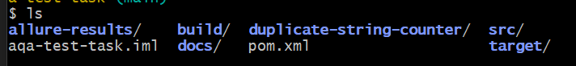

---

## 2. `cd`  Change directory
Description: Changes the current working directory.

```bash
cd src
```

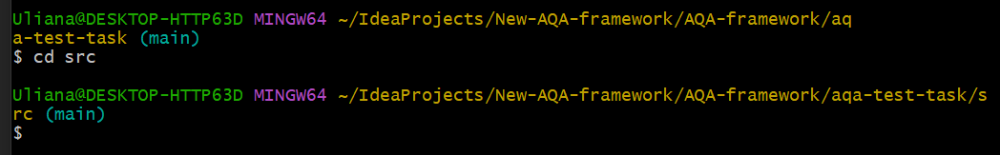

---

## 3. `pwd`  Print working directory
Description: Shows the full path of the current directory.

```bash
pwd
```


---

## 4. `cp`  Copy files
Description: Copies files or directories from one location to another.

```bash
cp pom.xml pom_backup.xml
```
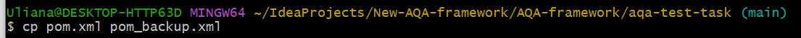

---

## 5. `mv`  Move or rename files
Description: Moves a file to another location or renames it.

```bash
mv pom_backup.xml docs/pom_backup.xml
```


---

## 6. `rm`  Remove files
Description: Deletes files or directories permanently.

```bash
rm docs/pom_backup.xml
```


---

## 7. `mkdir`  Make directory
Description: Creates a new directory.

```bash
mkdir test-folder
```
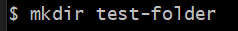

---

## 8. `rmdir`  Remove empty directory
Description: Removes a directory only if it is empty.

```bash
rmdir test-folder
```
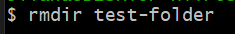

---

## 9. `cat`  Display file content
Description: Prints the content of a file to the terminal.

```bash
cat config.properties
```
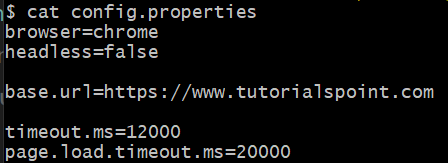

---

## 10. `touch`  Create empty file
Description: Creates a new empty file.

```bash
touch test.txt
```
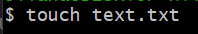

---

## 11. `grep`  Search text in files
Description: Searches for lines matching a pattern inside a file.

```bash
grep "selenide" pom.xml
```
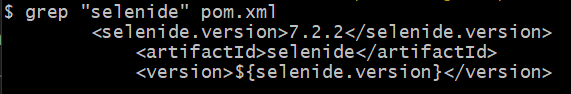

---

## 12. `find`  Search for files
Description: Searches for files matching given criteria.

Command breakdown:
1. `.` Start searching from the current directory
2. `-name` Filter by file name
3. `"*.png"` Pattern to match (all files ending with .png)

```bash
find . -name "*.png"
```
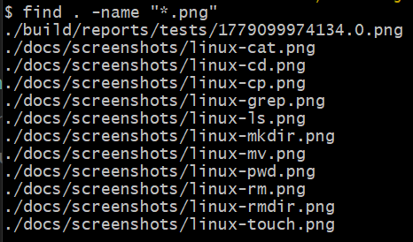

---

## 13. `chmod`  Change file permissions
Description: Sets read, write, and execute permissions for a file.

Permission symbols:
1. `r` Read (can view file content)
2. `w` Write (can modify file)
3. `x` Execute (can run file as a program)
4. `+` Add permission
5. `-` Remove permission

```bash
chmod +x pom.xml
```
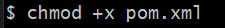

---

## 14. `df`  Disk space usage
Description: Shows how much disk space is used and available.

`-h` flag stands for **human-readable** and displays sizes in GB, MB instead of raw bytes.

```bash
df -h
```
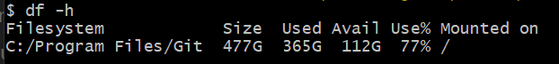

---

## 15. `top`  Display running processes
Description: Shows a live view of running processes and resource usage.

Key shortcuts inside `top`:
1. `q` Quit
2. `M` Sort by memory usage
3. `P` Sort by CPU usage
4. `k` Kill a process by PID

Note: The screenshot below shows how it looks on a Linux system, not Windows.

```bash
top
```
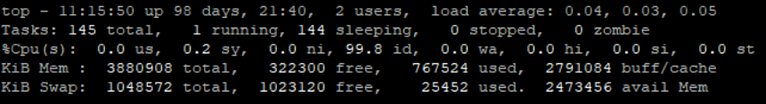